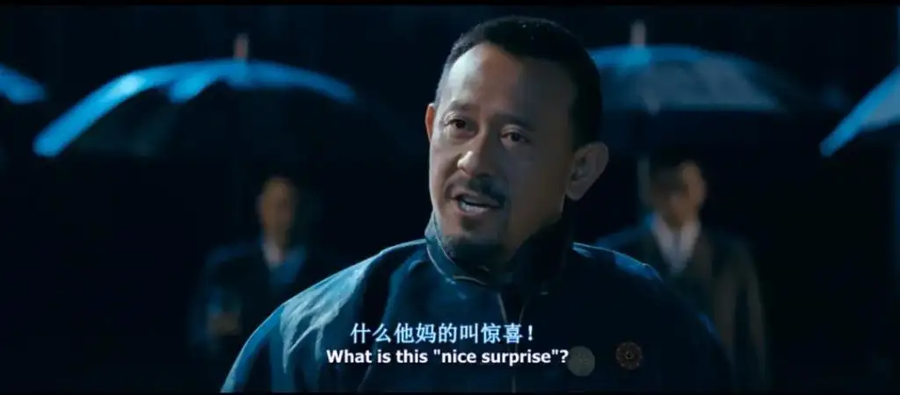

# 随想

学代码最好的方式是看别人写的项目，去学别人的思路，去看别人是怎样用你知道的东西创造出了你想不到的东西，然后再自己动手敲一敲，感受感受，体验一下。什么叫惊喜？这他妈的就叫惊喜。

看语录，收集电影截图，慢慢培养自己的普世价值观。

小时候是能够轻易做到的，所以很自信，有一个最小的负反馈和积极的正反馈。但是现在不一样了，现在没有了相对的安全感，做什么都畏首畏尾，完全是一个消极的负反馈，自然也就逐渐缺乏自信了。

直接生活、想明白就好了、保持阅读并坚持分享
、热爱家人、保持工作和底层思维一致就好了、运动员常用策略

# 记一次解决问题的经过

问题：首页展示一个时间戳
